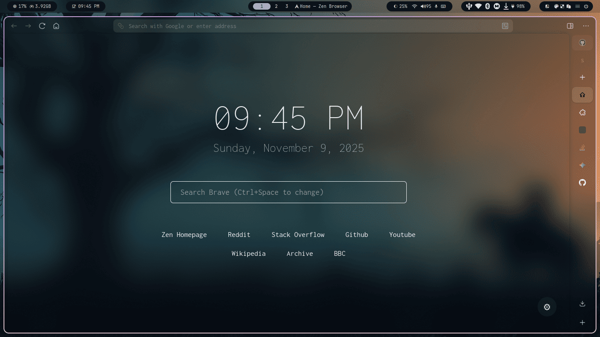
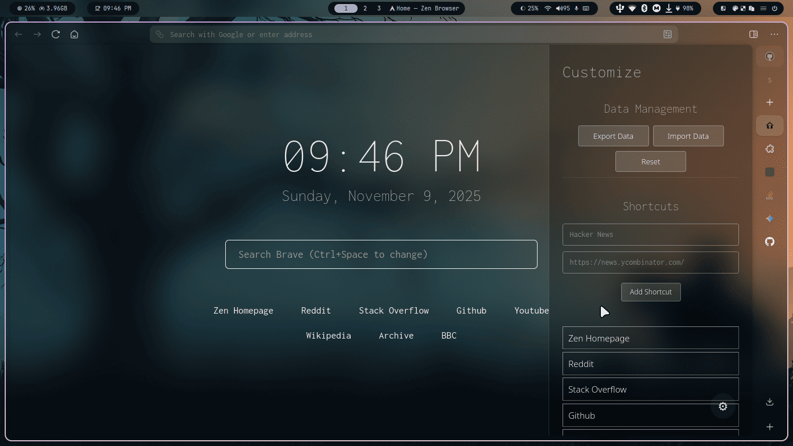
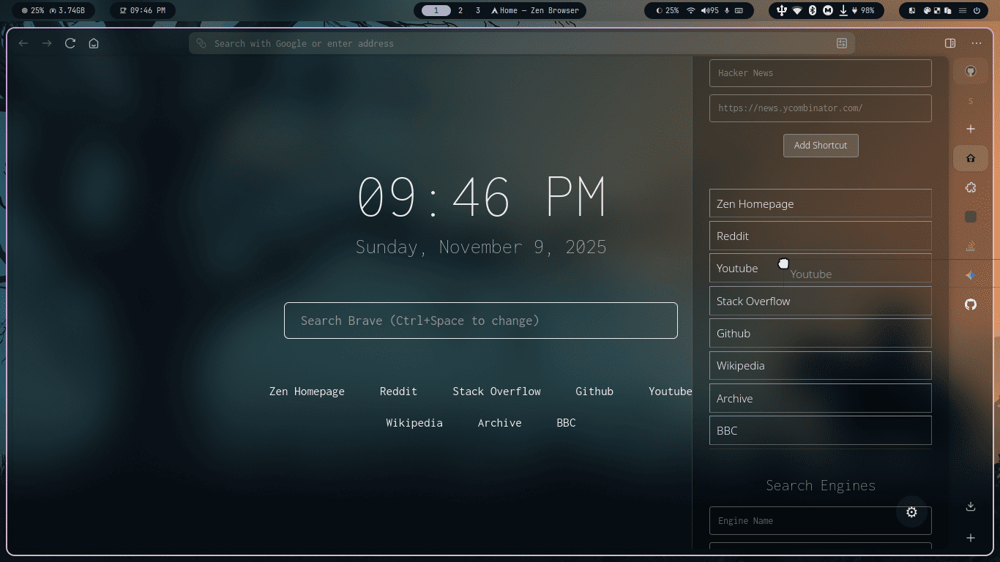
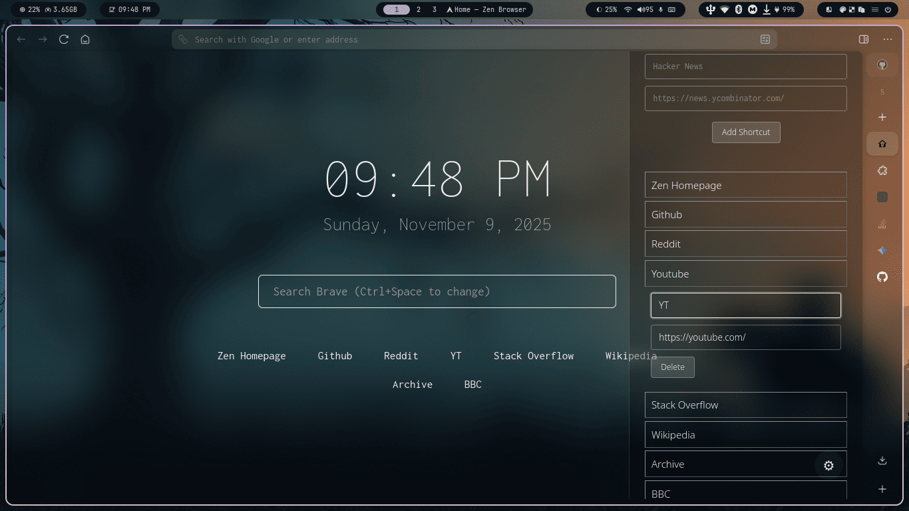

# Zen Homepage

> [!IMPORTANT]  
> This homepage is for transparent firefox only.

A simple, fast, and highly customizable browser startpage designed for **minimalism** and **efficiency**.

-----

## Core Features and Customization

This minimalist homepage is designed for efficiency and a clean, terminal-like aesthetic, offering powerful customization options accessible via the **Settings Panel**.

### User Interface and Design

* **Real-Time Clock and Date:** A dynamically updated display showing the current time and date, powered by lean JavaScript for constant accuracy.
* **Monospace Aesthetic:** The interface utilizes the highly readable **Inconsolata** font stack, delivering a distinct, clean, and **terminal-like** visual style that minimizes distraction.

### Shortcuts and Search Functionality

* **Dynamic Search Engine Cycling:** Quickly switch your search context between different providers (e.g., **Google**, **YouTube**, **GitHub**) directly within the main input field using simple keyboard commands.
    * **Next Search Engine:** Press $\text{Ctrl} + \text{Space}$ (or $\text{Cmd} + \text{Space}$ on macOS).
    * **Previous Search Engine:** Press $\text{Ctrl} + \text{Shift} + \text{Space}$.
* **Quick Links ("The Shelf"):** A customizable list of essential website shortcuts displayed discreetly at the bottom of the page for rapid access.

### Customization Panel (Gear Icon)

Access the **Settings Panel** (via the **gear icon** $\boldsymbol{\text{⚙}}$) for full control over your shortcuts and search engines:

* **Manage Shortcuts & Search Engines:** Easily **add new** entries, **edit** existing ones, or **delete** them.
* **Reordering:** Customize the display order of your quick links and search engines by **dragging and dropping** them within the list.

-----

## Installation Guide

This project offers two primary methods for installation: using the hosted **GitHub Page** URL directly, or installing the provided **Browser Add-on** for a cleaner, server-free setup.

### Option 1: Using the Hosted GitHub Page (Simplest)

The homepage is hosted at: `https://shashotonur.github.io/zen-homepage/`

* **As Homepage:** Set the URL above as your browser's custom **homepage**.
* **As New Tab Page:** Use a browser extension (like **"New Tab Override"** for Firefox) that allows you to specify a custom URL for new tabs. Set the URL above within that extension's settings.

### Option 2: Server-Free Browser Add-on (Recommended for New Tab)

This method uses the pre-built browser extension for direct installation, bypassing external hosting.

1.  **Install the Add-on:**
    * Locate the extension file, typically named similar to `zen-homepage-vX.X.X.xpi`, inside the local **`web-ext-artifacts`** directory.
    * **Open** this `.xpi` file directly with your browser (e.g., File > Open File, or drag-and-drop) to begin the installation.
    * The add-on should automatically be configured to serve as your **new tab page**.
2.  **Set as Custom Homepage (If Needed):**
    * The homepage setting requires the internal URL assigned to the installed add-on.
    * Open a **new tab** (which should now display the extension's page).
    * Open your browser's **Web Console** (usually F12 or Ctrl+Shift+K/I).
    * Run the following command in the console: `window.location.href`
    * **Copy** the resulting output URL (this is the internal path, e.g., `moz-extension://...`).
    * Set this copied URL as your browser's custom **homepage**.

-----

## Preview

**Homepage**

**Side Panel**

**Drag Preview**

**Editing Preview**

-----

## License

This project is open-source and available under the [MIT License](LICENSE).

-----
