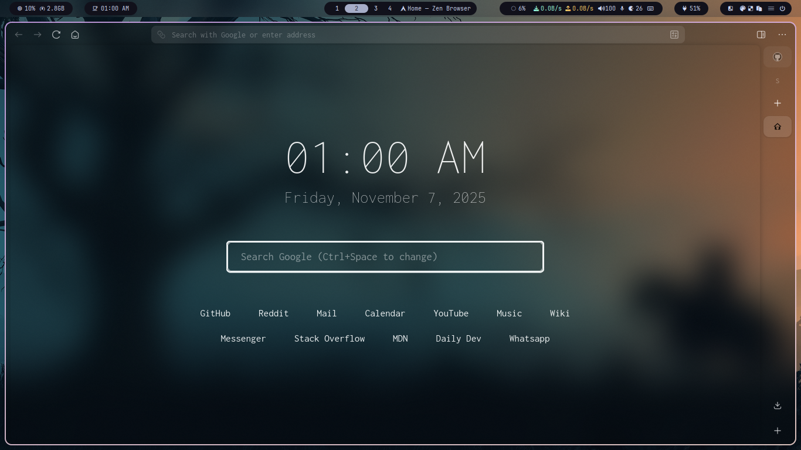

# Zen Homepage

A simple, fast, and highly customizable browser startpage designed for **minimalism** and **efficiency**. This single-file project provides a clean interface featuring a clock, a powerful search bar, and essential quick-access links, making it an ideal replacement for your browser's default New Tab page.

-----

## Features

  * **Real-Time Clock and Date:** Displays the current time and date, dynamically updated every second using clean JavaScript.
  * **Monospace Aesthetic:** Uses the highly readable **Inconsolata** font stack to deliver a distinct, clean, and terminal-like visual style.
  * **Dynamic Search Engine Cycling:** Switch between different search providers (Google, YouTube, GitHub, etc.) directly from the input field using a simple keyboard shortcut.
  * **Keyboard Shortcut:**
      * Use **`Ctrl + Space`** (or $\text{Cmd} + \text{Space}$ on macOS) to cycle to the **next** search engine.
      * Use **`Ctrl + Shift + Space`** to cycle to the **previous** search engine.
  * **Quick Links ("The Shelf"):** A customizable list of essential website shortcuts displayed at the bottom.
  * **Zero Dependencies:** The entire startpage is contained within one self-sufficient **`index.html`** file (HTML, CSS, and JavaScript are inline) for maximum portability and speed.

-----

## Installation

Since this project is a single HTML file, setup is straightforward.

1.  **Save the file:** Save the provided code as a file named `index.html` on your local computer (e.g., in your Documents folder).
2.  **Configure your Browser:**
      * **New Tab Page:** To use this as your New Tab page, you will likely need a browser extension like **"New Tab Override"** or something similar. Use the extension to redirect your new tab to the path of your saved file (e.g., `file:///path/to/your/index.html`).
      * **Homepage:** Alternatively, set your browser's homepage to the local path of your `index.html` file.

-----

## Customization

You can tailor the startpage to your preferences by editing the `index.html` file.

### 1\. Search Engines

Modify or add new search engines by editing the `engines` array located within the bottom `<script>` block.

| Property | Description |
| :--- | :--- |
| `name` | The friendly name that appears in the search input placeholder (e.g., "GitHub"). |
| `action` | The base URL the form submits to (e.g., `https://github.com/search`). |
| `param` | The **query parameter** name used by the search engine to pass the search term (e.g., `q` for Google, `search_query` for YouTube). |

**Example:**

```javascript
const engines = [
    { name: "Google", action: "https://www.google.com/search", param: "q" },
    { name: "YouTube", action: "https://www.youtube.com/results", param: "search_query" },
    // Add a new engine:
    { name: "Bing", action: "https://www.bing.com/search", param: "q" }, 
    // ...
];
```

### 2\. Quick Links

The displayed shortcuts are located in the `<ul id="shelf">` element under the `<section id="links">` block.

To change a link, modify the `href` and the visible text.

```html
<ul id="shelf">
    <li class="shortcut"><a href="https://github.com/" title="GitHub">GitHub</a></li>
    <li class="shortcut"><a href="https://reddit.com/" title="Reddit">Reddit</a></li>
    </ul>
```

### 3\. Appearance and Colors (CSS)

All styles, including the dark mode color scheme, are in the `<style>` block at the top of the file.

You can adjust the theme colors using the CSS variables defined in `:root`:

```css
:root {
    --text-color: #fff; /* Controls text and border color */
    --bg-color: #000;   /* Controls the optional body background */
}
```

To enable a solid background instead of a transparent one (which lets your browser's background/wallpaper show), **uncomment** the `background` line in the `body` CSS rule:

```css
body {
    color: var(--text-color);
    /* Uncomment if background is not transparent */
    /*background: var(--bg-color);*/ 
    /* ... other styles ... */
}
```

-----

## Preview



-----

## License

This project is open-source and available under the [MIT License](LICENSE).

-----
